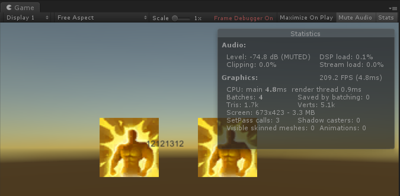
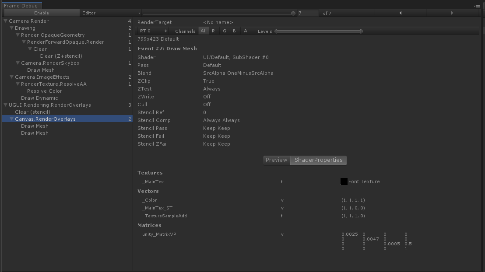
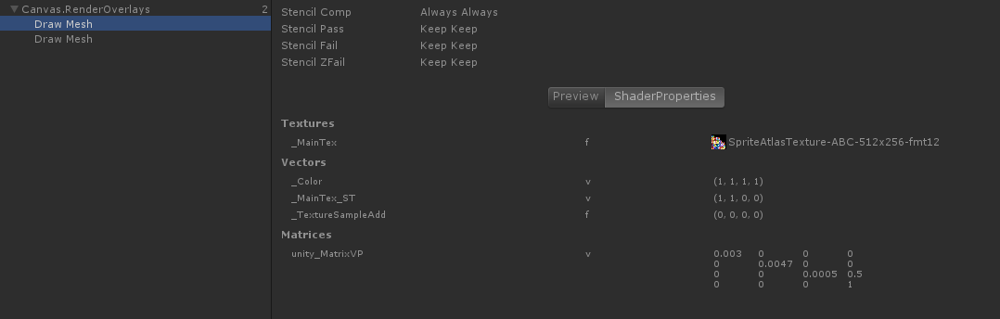
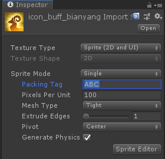
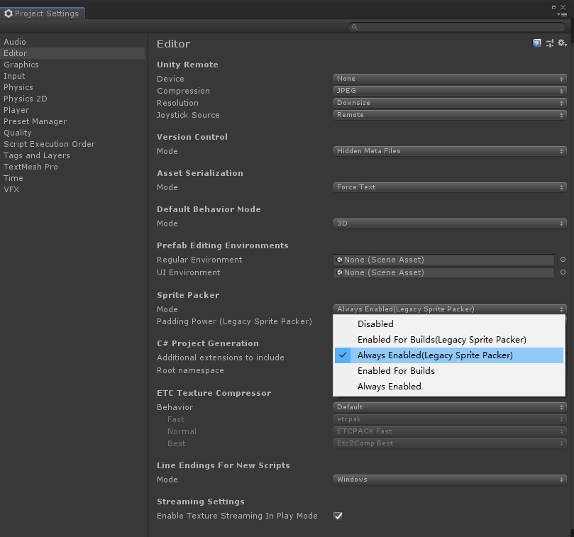
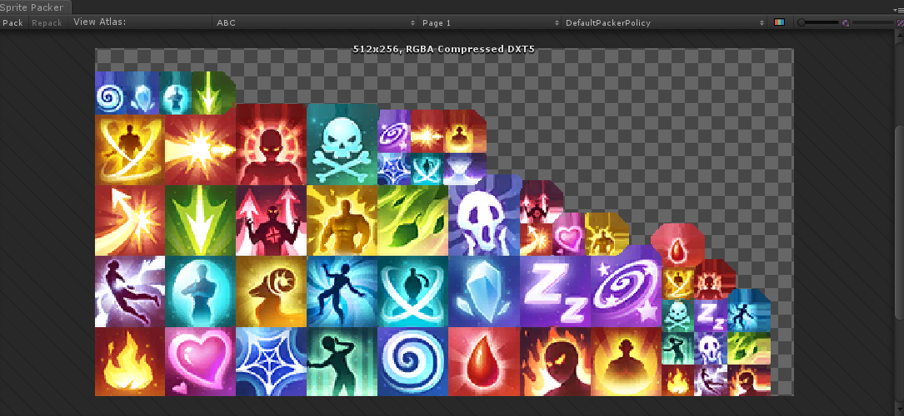
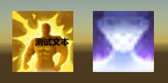
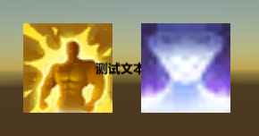
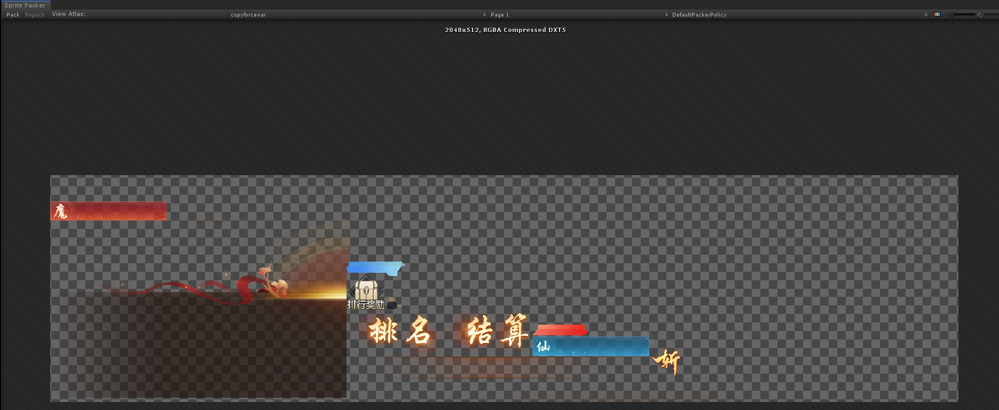

# DrawCall控制

* DrawCall 说明 / 查看
* UGUI
* 3D场景

## DrawCall 说明

DrawCall ，也能叫批处理，是指 Unity 每一帧中通过 CPU 向 GPU 发送的一条绘制指令，传输包括模型的顶点，法线贴图，纹理贴图等等数据。由于 GPU 的处理图形速度比 CPU 快，所以通常都是 GPU 处于空闲状态而，渲染的速度就由 DrawCall 次数决定。同样 100 个物体，一次绘制和分100次绘制，效率显然不同。

## DrawCall 查看以及 Frame Debug

Game 窗口中点开 Stats 面板，就可查看当前的渲染信息，如三角面数Tris，顶点数Verts 以及Draw Call（批处理）Barches。这些信息运行游戏时会更准确。

还有一个非常好用的工具，帧的 Debuger，可以查看当前一帧的每一次 DrawCall 的内容。可通过 Window -> Analysis -> Freme Debug 调出，并在运行游戏后，在需要 Draw Call 的画面中，点击 Enable 对当前帧进行剖析。右侧面板会列出当前 Draw Call 的详细信息，材质以及使用的纹理素材。可以看到这个 Draw Call 中使用了图集

Unity 中对能批处理的渲染有一定的要求，而对于 UGUI 来说，就是使用同一个材质且同一个贴图。UGUI 默认都使用 Default UI Material，所以还需要做的就是使用同一个贴图 **（虽然用的是同一个材质，但 Image, RawImage, Text 用的不是同一个贴图，所以不能相互不能和进一个 Draw Call）**。Unity 提供的是 Sprite Packer 图集的策略，将几张图成一张，对于不同的 UI，则改变UV，取各自所需。图集打包到材质 UV 替换，都是 Unity 已经提供实现的。我们要做的就是对不同图片确定打进哪个图集。

## Sprite Packer

对于导入设置为 Sprite (2D and UI) 的素材，输入 Packing Tag 即可指定该素材打入的图集中。**（Resource 目录下无法设置图集）**

Unity 2018.3.14f1 中，Edit -> Project setting -> Editor -> Sprite Packer -> Always Enabled（Legacy Sprite Packer） 打开图集查看和打包功能。

设置图集名称并且打开图集打包功能后，就可以通过 Window -> 2D -> Sprite Packer -> Pack 打包并查看所有图集；View Alset 可以选择查看不同的图集

## UI 层级排布的影响

在属于同图集，且 UI 元素都属于一个**视觉**层级时，就可进行批处理。

## 样例说明

* 未使用图集或不同图集两个 Image 会用两个 Draw Call 绘制
* 同个图集，两个 Image 会用一个 Draw Call 绘制，无论是否重合
* 同个图集，但穿插一个 Text
  * 不影响其他元素的视觉层级：仅增加一个 Draw Call

    

  * 影响其他元素的视觉层级，破坏 Image 的批处理，新增 2 个 Draw Call

    

* UI 的透明度设置为 0 ，这个 UI 元素就不会改变视觉层级，也就不会导致 Draw Call 的提升。例如视觉层级是穿插关系的 image -> text -> image， Draw Call 会是 3 个，而将 text 的 alpha 改为 0 就变成 2 个
* text 的大小是以文字的长度算的，而不是 width 和 heigth，当 text 的文字为空时，相当于 text 不存在。
* UI 元素当 GameObject SetActive = false，或 组件 Disable 就不会影响 Draw Call

请仔细理解是**视觉层级**的含义，网上很多博客所说更改 Hierarchy 中的UI元素层级就可降低 Draw Call 是错误的。

## 图集的优化

降低 Draw Call 需要用到图集，一来可以降低 Draw Call，一来可以降低内存和硬盘的 IO 频率。但是，没有经过合理安排的图集会导致包体增大，渲染也可能不减反增。因为每次渲染图集中的任何一张小图，都需要将一整张图集加载进 GPU。

在 Unity 中，为了渲染方便，图集的大小都是 2^n 长宽，例如 1028 \* 513 尺寸的图片，塞进图集成为一张 2048 \* 1024 的图片。至于这一点，有几种做法

* 可以和美术商量压缩一下尺寸 1024 * 512，因为差别非常小，但是容量的占用瞬间就降低了 3/4 的大小。
* 美术拒绝缩减
  * 图片是否是九宫格，是则用九宫格模式代替
  * 图片是否可拆分，对称的话可以拆成一半
  * 图片是否可拆分，非对称的话尝试拆分成小部件，再重组（这方法无法降低 Draw Call，主要用于降低包体）
* 对于小，多，杂素材组合导致的图集打成倍增长的问题，着可通过重新分配图集解决。
