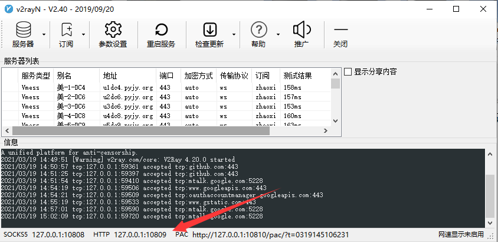

# 查看日志

## git log --pretty=oneline

注意 `--pretty=oneline` 无空格
该命令是查看当前所在分支的 log，也能看到远程分支的。Head 表示当前 origin/branch 表示远端分支。

## git log origin/branch --pretty=online

查看远程分支 branch 的 log。

## 创建分支

## Push & Pull

当在 github 中存在一个 repository 时，可以复制链接，并在本地文件夹使用 `git pull url` 将远程仓库内容拉去（pull）下来，或者用 `git clone url`。

当使用直接使用 pull 时，是不会建立远程仓库和本地仓库的连接的，而 clone 会。所以当后续需要对远程仓库进行推送或更新（push/pull）时，会提示没有分支跟踪信息。所以需要建立连接

``` shell
##查看当前远程分支情况，如果没有，则没有输出
git remote -v

##确认没有，添加远程分支
##git remote add REMOTE_NAME URL
git remote add origin URL

##添加完毕后，再次查看，可以看到两个输出，分表代表 pull 和 push 权限

## 然后建立连接
## git branch --set-upstream-to=REMOTE_NAME/BRANCH_NAME LOCAL_BRANCH_NAME
git branch --set-upstream-to=origin/master master

#最后进行全部更新
git pull
#or 指定某个 repository 更新到本地某个分支
git pull origin master
```


## 使用代理

使用 git 经常会出现访问不到仓库的情况，这时候可以借助 VPN。开启 VNP 后，查看 VPN 的代理端口，然后设置 git 通过代理窗口访问。用我常用的 win 和 mac 下的软件做示范。

* Window

  

```shell	
git config --global --add remote.origin.proxy "127.0.0.1:10809"
```


# 问题

hint: You have divergent branches and need to specify how to reconcile them.

hint: You can do so by running one of the following commands sometime before

hint: your next pull:

hint: 

hint:  git config pull.rebase false # merge (the default strategy)

hint:  git config pull.rebase true  # rebase

hint:  git config pull.ff only    # fast-forward only

hint: 

hint: You can replace "git config" with "git config --global" to set a default

hint: preference for all repositories. You can also pass --rebase, --no-rebase,

hint: or --ff-only on the command line to override the configured default per

hint: invocation.
