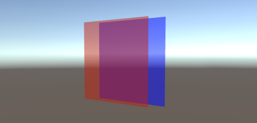
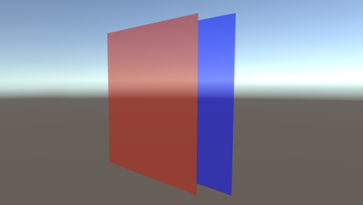

# 透明物体的渲染流程

透明度测试/深度测试 -> 深度写入 -> 光照计算 -> 缓冲混合

当渲染一个片元时，需要先经过测试（若开启），并进行深度写入Depth Buff（若开启），如果测试不通过，片元就会被抛弃，不走后面流程。

测试则是指片元某些属性大于给定值或者说大于 0。

对于深度测试来说，如果当前片元的深度比 Depth Buff 中的要深，说明被遮挡了，会被抛弃。但是有个例外如果深度浅的物体是半透明的，片元的颜色应为两者颜色的混合。

所以渲染中包含透明的物体时，渲染顺序是非常重要的。

为了处理这个种情况，Unity 预制了几种渲染队列控制渲染顺序（优先级数字小的优先）

| | 含义 | 优先级 |
| --- |---| --- |
|BackGround| 不透明物体 | 1000 |
|Geometry| 默认渲染队列 | 2000 |
|AlphaTest| 透明度测试 | 2450 |
|Transparent| 透明度物体或关闭了深度写入的物体 | 3000 |
|Overlay|顶层队列，用于叠加|4000|

不仅如此，对于处于渲染队列为 的图元还会按有远到近渲染。但是处于其他队列的物体就是无序的。

渲染队列可以在 shader 中 Tags 指定如 `Tags { "Queue" = "AlphaTest" }`。又或者在 Material 中直接修改，相当于覆盖掉代码 Queue。

这些渲染顺序都可以通过 Frame Debuger 检验。

## 渲染顺序，ZWrite 和 Cull

``` shaderlab
// Cull 剔除模式
Cull back       // 背面剔除，默认
Cull front      // 正面剔除
Cull off        // 双面渲染

// ZWrite 深度写入
ZWrite off      // 关闭
ZWrite on       // 开启
```

如果考虑要显示一个最真实的透明度效果，应该是怎样的。

* 对于几何物体，要能看到内部结构
* 颜色混合符合透明度的比例
* 物体前后关系正确

对于透明物体 A 和 透明物体 B，AB 的前后关系是会影响混合的颜色的。所以前后关系正确，混合比例才会正确。那怎么衡量 A B 哪个近呢？实际上无法区分，因渲染是以一个个三角分别进行的，无法处理穿插的情况，对于非垂直于视角的平面也是如此。

举个例子，当有如下两个面片，A （红）在前 B （蓝色）在后。


同样是在正面观看两个面片的融合情况，变动下摄像机的角度可能会造成不同的结果




下面介绍几种处理透明物体的设置以及理解。

``` shaderlab
Pass {
    Cull off
    ZWrite off
}
```

可以看到内部结构，但是不同面的层次可能错乱

``` shaderlab
Pass {
    Cull back
    ZWrite on
}

// 等同于
Pass {
    ZWrite on
    ColorMask 0
}

Pass {
    Cull back
    ZWrite off
}
```

可视部分整体透明变化，层次正确，由于深度写入，重合部分颜色可能为深度浅的颜色

``` shaderlab
Pass {
    Cull front
    ZWrite off
    // render ...
}

Pass {
    Cull front
    ZWrite off
    // render ...
}
```

双 Pass 保证**一个物体正反面**渲染顺序

总的来说，需要较为理想透明融合效果时，我们可以关闭 Zwrite，并用双 Pass 避免物体本身正反面渲染乱序问题。需要融合效果但是更加在意前后关系的区分，则需要开启 Zwrite。

## 融合模式、融合参数

当片元通过测试检测，就进入计算颜色并存入缓存的阶段。在此阶段我们可以控制融合颜色的方法，写法如下

``` shaderlab
Pass {
    BlendOp Type                         // default is Add
    Blend Factor1 Factor2, Factor3 Factor4    // factor
}
```

融合中，我们称新计算出来的颜色为 SrcColor (源颜色)，处于颜色缓冲区的颜色为 DstColor (目标颜色)。BlendOp 用于指定融合操作，Blend 用于指定融合因子。公式为

``` txt
newColor.rgba = BlendOp_TypeFunc(SrcColor * Blend_Factor1, DstColr * Blend_Factor2)
```

SrcColor 和 DstColor 会分别先乘以 Factor1 和 Factor2，然后再交由 BlendOp 指定的融合操作进一步处理。**注意顺序**

一般只指定 Factor1 和 Factor2 统一处理颜色 RGBA 计算。若需要额外处理透明度，可以增加 Factor3, Factor4 对透明图进行控制。就会变成

``` txt
newColor.rgb = BlendOp_TypeFunc(SrcColor.rgb * Blend_Factor1, DstColr.rgb * Blend_Factor2)
newColor.a = BlendOp_TypeFunc(SrcColor.a * Blend_Factor3, DstColr.a * Blend_Factor4)
```

### BlendOp - 融合操作

| BlendOp Type | 描述 |
|---|---|
|Add|加|
|Sub|混合后的 SrcColor 减去混合后的 DesColor|
|RevSub|混合后的 DesColor 减去混合后的 SrcColor|
|Min|逐分量去最小值|
|Max|逐分量去最大值|

注意: 当使用了 `Max` 或 `Min` 后，混合因子将无效。

### Blend - 融合因子

| Blend Factor| 描述 |
|---|---|
|One|1|
|Zero|0|
|SrcColor|Src 颜色的 RGBA|
|SrcAlpha|Src 中的 Alpha|
|DstColor|Dst 颜色中的 RGBA|
|DstAlpha|Dst 中的 Alpha|
|OneMinusSrcColor|1 - Src 颜色中的 RGBA|
|OneMinusSrcAlpha|1 - Src 颜色中的 Alpha|
|OneMinusDstColor|1 - Dst 颜色中的 RGBA|
|OneMinusDstAlpha|1 - Dst 颜色中的 Alpha|

BlendOp 和 Belnd 的组合艺术效果还没理解明白。