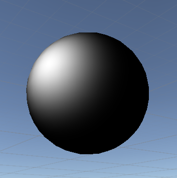
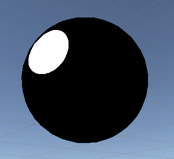
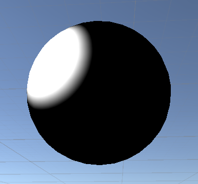
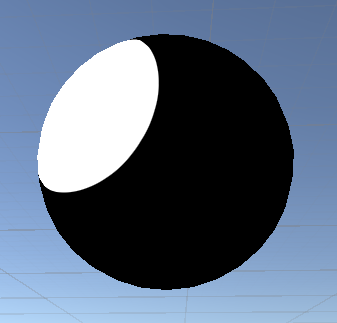
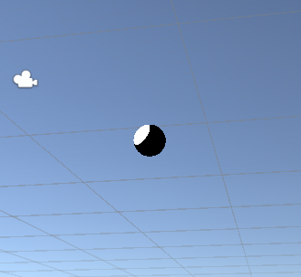
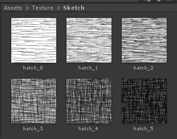

# 非真实渲染 Non-Photorealistic Rendering

## 卡通风格渲染

先下基本的卡通风格特点

* 物体会有轮廓
* 颜色是阶梯式变化，或面片间颜色变化突变

### 颜色阶梯变化

漫反射可以渐变纹理，用计算出的漫反射强度在渐变纹理中取样，得到阶梯变化的漫反射强度，再进行颜色融合。

对于高光，先看下罗伯特光照模型下的公式以及效果

``` ShaderLab
fixed3 worldHalfDir = normalize(worldLightDir + worldViewDir);
fixed3 specular = _SpecularColor.rgb * pow(max(0, dot(worldNormal, worldHalfDir)), _Gloss);
```



可以看出，高光是渐变的，渐变的突变程度主要取决于 _Gloss。

为了达到色块的效果，基于原本的光照模型，我们就必须将 _Gloss 尽量提高。但是更高的平方会带来更大的计算量，且不好控高光的范围。

所以不妨直接设置一个阈值 _Threshold，当高光反射强度大于 _Threshold 就直接返回高光，否则没高光，于是有：

``` ShaderLab
fixed3 worldHalfDir = normalize(worldLightDir + worldViewDir);
fixed3 specular = _SpecularColor.rgb * step(0.0001, dot(worldNormal, worldHalfDir) - _Threshold);
```



对于简单的判断 step 会比 if 更合适。于是我们已经用一个很简约的方式实现了色块高光的效果，基本上已经可以了。但还有点小缺陷，可以看到高光区域有明显的锯齿。(其实球的边界部分也有)

所以计算高光的函数应该包含段落以及渐变特性。smoothstep 和 lerp 就符合这点。

* lerp(a, b, c) : c 范围[0, 1]时，根据比例在 a b 中插值，否则取边界值。

``` ShaderLab
fixed3 specular = _SpecularColor.rgb * lerp(0, 1, (spec - _Threshold) * _Scale);
```

首先高光的边界渐变必须从无到有，所以边界值设置为0，1。_Threshold 控制高光起始位置，_Scale 则是用于缩减边界过渡段宽度。

* smoothstep(a, b, c) : 当 c 在 a b 之间时，生成 [0, 1] 平滑过渡，否则取边界值 0 或 1。

``` ShaderLab
fixed3 specular = _SpecularColor.rgb * smoothstep(0, 0.01, spec - _Threshold)
```

smoothstep 则因为函数特性，输出范围就是0，1。0.01则是过度段长度。

此时，两个函数只要调下参数，就可以很好的实现抗锯齿的效果了。

未调节过度段长度



适当调节后



近距离下，对比高光和球体周围，高光的锯齿已经基本消除。但是拖远了看，还是有锯齿



锯齿出现的根本原因是因为单位像素内包含的颜色信息过多，随着距离增加，如果不增加颜色过渡段长度，就相当于在距离不变的情况下缩减了颜色过渡段。所以颜色过渡段长度，应该是要和距离程反相关。

在我的测试下两个函数可改为

``` ShaderLab
float dis = length(_WorldSpaceCameraPos - i.worldPos);
// Lerp
fixed3 specular = _SpecularColor.rgb * lerp(0, 1, (spec - _Threshold) * (160 / dis));
// Smoothstep
fixed3 specular = _SpecularColor.rgb * smoothstep(0, 0.01 * dis, spec - _Threshold);
```

以上效果均为粗略计算的结果，再较远的情况下，表现并不如意。如果再设计下函数，可能可以提升效果，但是由于计算中夹带着 dis 包含开根号操作，即使效果满意，效率不会太好。

《Shader 入门精要》书本中介绍了使用 `fwidth` 计算边界的方法。此方法是针对 smoothstep 的，如下。

``` ShaderLab
fixed spec = dot(worldNormal, worldHalfDir);
fixed w = fwidth(spec) * 2.0;
fixed3 specular = _SpecularColor.rgb * smoothstep(0, w, spec - _Threshold);
```

fwidth 经介绍，是用于计算当前像素的偏导数，也就是变化率。当在正常距离内，spec 是很相近的两个球面的高光强度差值，很小。随着距离增大，两个像素内的高光强度会因为实际对应的点位边远，强度变化增加，w 也会相应增大一些。

所以对于最后一种做法我是比较满意的，第一消耗不大，我可以很好理解。smoothstep 得函数曲线也相对 lerp 来的平滑自然。

最后写下《Shader 入门精要》的做法，因为部分内容无法理解，且经和我删后得出的最后一种做法相差无几，所以不打算采用。希望后面能理解作者这种写法意图。

``` ShaderLab
fixed spec = dot(worldNormal, worldHalfDir);
fixed w = fwidth(spec) * 2.0;
float dis = length(_WorldSpaceCameraPos - i.worldPos);
fixed3 specular = _SpecularColor.rgb * lerp(0, 1, smoothstep(-w, w, spec + _SpecularScale - 1)) * step(0.0001, _SpecularScale);
```

疑点

1. 为什么 lerp 要和 smoothstep 共用？
2. smoothstep 参数要设置成(-w, w, spec + _SpecularScale - 1)
3. 为什么不使用阈值 _Threshold

## 素描风格

在素描中，画面的明暗过度是通过笔画的密集程度和笔触的力度表现的。所以，如果将物体的颜色通过这些笔触纹理表示，就能模仿素描的效果。

首先根据笔触纹理级别，假设有 n 级，将光照强度划分为 n + 1。当光照强度属于 n + 1 级为纯白，其他区间内则为相邻等级间的纹理融合结果。



``` ShaderLab
v2f vert(a2v i) {
    v2f o;
    o.pos = UnityObjectToClipPos(i.pos);

    float4 worldPos = mul(unity_ObjectToWorld, i.pos);
    float3 worldNormal = UnityObjectToWorldNormal(i.normal);
    float3 worldLightDir = UnityWorldSpaceLightDir(worldPos);
    o.worldPos = worldPos;

    float diffuse = max(0, dot(normalize(worldNormal), normalize(worldLightDir)));

    diffuse = diffuse * 6.0;
    o.hatchWeight0 = fixed3(0, 0, 0);
    o.hatchWeight1 = fixed3(0, 0, 0);

    if (diffuse > 5.0) {
        // pure white
    } else if (diffuse > 4.0) {
        o.hatchWeight0.x = diffuse - 4.0;
        o.hatchWeight0.y = 1 - o.hatchWeight0.x;
    } else if (diffuse > 3.0) {
        o.hatchWeight0.y = diffuse - 3.0;
        o.hatchWeight0.z = 1 - o.hatchWeight0.y;
    } else if (diffuse > 2.0) {
        o.hatchWeight0.z = diffuse - 2.0;
        o.hatchWeight1.x = 1 - o.hatchWeight0.z;
    } else if (diffuse > 1.0) {
        o.hatchWeight1.x = diffuse - 1.0;
        o.hatchWeight1.y = 1 - o.hatchWeight1.x;
    } else {
        o.hatchWeight1.y = diffuse - 0.0;
        o.hatchWeight1.z = 1 - o.hatchWeight1.y;
    }

    TRANSFER_SHADOW(o);

    o.uv = TRANSFORM_TEX(i.texcoord, _MainTex);
    // 控制素描笔画的密集程度
    o.uv = o.uv * _TileFactor;

    return o;
}

fixed4 frag(v2f i) : SV_TARGET {
    fixed3 color = fixed3(1.0, 1.0, 1.0);
    fixed3 hatchColor0 = tex2D(_Hatch0, i.uv).rgb;
    fixed3 hatchColor1 = tex2D(_Hatch1, i.uv).rgb;
    fixed3 hatchColor2 = tex2D(_Hatch2, i.uv).rgb;
    fixed3 hatchColor3 = tex2D(_Hatch3, i.uv).rgb;
    fixed3 hatchColor4 = tex2D(_Hatch4, i.uv).rgb;
    fixed3 hatchColor5 = tex2D(_Hatch5, i.uv).rgb;

    fixed3 totalHatchColor =
        i.hatchWeight0.x * hatchColor0 +
        i.hatchWeight0.y * hatchColor1 +
        i.hatchWeight0.z * hatchColor2 +
        i.hatchWeight1.x * hatchColor3 +
        i.hatchWeight1.y * hatchColor4 +
        i.hatchWeight1.z * hatchColor5;

    fixed3 whiteColor = (1.0 -
        i.hatchWeight0.x -
        i.hatchWeight0.y -
        i.hatchWeight0.z -
        i.hatchWeight1.x -
        i.hatchWeight1.y -
        i.hatchWeight1.z) * color;

    UNITY_LIGHT_ATTENUATION(atten, i, i.worldPos.xyz);

    return fixed4((totalHatchColor + whiteColor) * atten, 1.0);
}
```

因为算法中包含较多 if else 判断，所以光照计算放在了顶点着色器。

更多非真实渲染介绍可以看这篇[博客](https://blog.csdn.net/poem_qianmo/article/details/78574734)