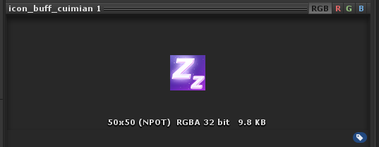
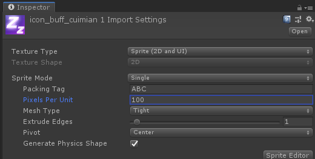
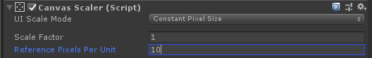
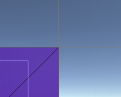

Canvas
    Render Mode
        Screen space - overlay
            pixel perfect 0001
            sort order
            target display
            additional shader channels
        Screen space - camera
            pixel perfect
            render camera
            order in layer
            additional shader channels
        World Space
            event camera
            sorting layer
            order in layer
            addition shader channels
    Pixel Perfect  


Canvas Scaler
    Mode:
        constant pixel size
            scale factor
            reference pixels 
        scale with screen size
            reference resolution
            screen match mode:
                match width or height
                expand
                shrink
            reference pixels per unit
        constant physical size
            physical unit:
                centimeters
                millimiters
                inches
                points
                picas
            fallback screen DPI
            default sprite DPI
            reference pixels per unit

## 图片在 Canvas 中的大小

用于 image 举例，一个 image 的 native rectTransform.size 是由 3 点决定

* sprite size
* Pixels per Unit
* Reference pixels per

### sprite size

直接是美术输出的尺寸，如图即 50 * 50 像素的一张图片



### Pixels per unit

点击素材，在 Inspector 中可以看到一个Pixels per unit 属性，表示对**这个素材**来说 Unity 每单位长度包含多少像素。如图，每单位显示 100 像素



### Reference pixels per unit

Canvas 物体上的 Canvas scaler 组件的属性，代表**参考的**每单位像素值，这个适合素材的 pixels per unit 对应的，如果两者一直，native 的大小，就是实际素材的大小。如果 reference pixels per unit 比 pixels per unit 大，则 native 比实际大，反之亦然。如图，参考每单位像素为 10



所以总的来说，一个 image 的 native 公式为

```C#
    native = spriteSize / pixelsPerUnit * referencePixelsPerUnit
```

## Canvas 显示位置

Canvas 有三种显示模式

* overlay

    覆盖模式，直接显示再屏幕上，但可以指定显示在哪个屏幕区域（display 1 - 7），该模式上的 UI 显示都是正交的，Y 轴旋转无透视效果
* camera

    附着相机模式，指定 canvas 只显示再哪个摄像机上，相当于摄像机的子物体跟随相机移动，是否是透视模式取决于挂载的摄像机设置

* worldSpace
    直接显示在场景世界坐标，任何摄像机都能观察到，但需要指定一个射线检测的摄像机用于 UI 事件，是否是透视模式取决于观察的摄像机设置

## 关于 Canvas 的 Pixel perfect

Rixel perfect 像素完美对其，官方文档说可以让图片显示更加清晰（没发觉），位置也更工整（没啥用）。Unity实际显示的最小位置变化，大概是0.0001个像素。当开启该选项，并移动 image 移 1 个单位的偏差时，就能发现区别了，如图：



中间灰色是对齐线，紫色是实际显示图片的一角，左下叫的白线是 rectTransform 的矩形大小框。

关闭像素对齐后


由于点位需要像素对齐，不足 1 单位的移动，不足以影响实际的显示，这就导致UI的一些动画会看起来卡。所以在需要做微小或连续的旋转、位移动画时，不建议开启该选项，实际上我觉得也没开的必要。。。

*有必要补充说明，实际的UI显示是用一系列点 UIVertex 组成的三角区域，再通过各点的 UV 线性差值采样纹理最后显示出图片的。rectTransform 的大小区域 size（也就是点击 W 出现的方框大小）是另外一回事，不参与渲染的显示。所以 pixel perfect 实际是指保证 UIVertex 是对像素整数对其。*

## 父子 Canvas 的层级问题

## Canvas scaler 的不同缩放模式
